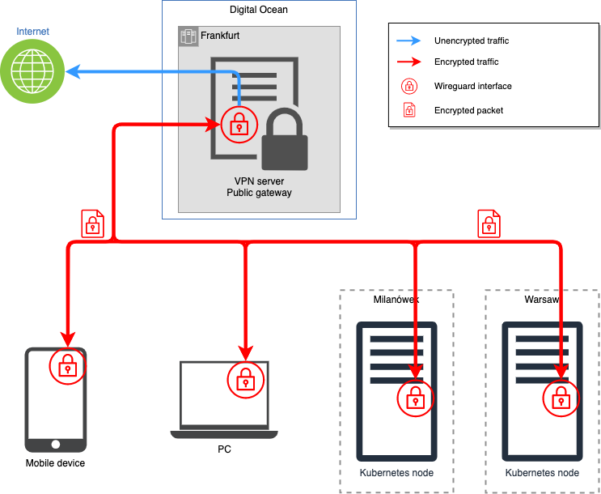

# Private Cloud on Kubernetes <!-- omit in toc -->

## Stage 1: Virtual Private Network
The goal of this stage was to create a VPN network between all hosts, which were supposed to be part of the PCK. For the encryption and networking software the Wireguard opensource project was chosen. 



Among many possible options for configuration of Wireguard the one using ip link command was used. For example, the wg-quick method was interfering with kubernetes networking rules, which resulted in unsuccessful execution of kubeadm create cluster command. In the project the following prerequisites were gathered and steps were followed to obtain fully functional VPN network based on Wireguard:

### Hosts
- Kubernetes hosts: Ubuntu 20.04, x86-64 architecture bare metal machine
- Motorola phone: Android 11, ARM architecture
- VPN Server: Ubuntu 20.04, x86-64 architecture virtual machine
### VPN configuration
#### VPN server wireguard configuration
1. Execute all commands as sudo: `sudo su` 
2. Install Wireguard: `apt-get update && apt-get install wireguard`
3. Generate keys: `wg genkey | tee privatekey | wg pubkey > publickey`
4. Create a configuration file: `nano /etc/wireguard/wg0.conf` and fill it in with the following content:
    ```
    [Interface]
    Address = 10.10.10.1/24
    ListenPort = 51820
    PrivateKey = <content-of-generated-privatekey-file>
    PostUp = iptables -A FORWARD -i wg0 -j ACCEPT;  iptables -t nat -A POSTROUTING -o eth0 -j    MASQUERADE; ip6tables -A FORWARD -i wg0 -j ACCEPT;     ip6tables -t nat -A POSTROUTING -o eth0 -j MASQUERADE
    PostDown = iptables -D FORWARD -i wg0 -j ACCEPT;    iptables -t nat -D POSTROUTING -o eth0 -j  MASQUERADE; ip6tables -D FORWARD -i wg0 -j ACCEPT;   ip6tables -t nat -D POSTROUTING -o eth0 -j MASQUERADE

    [Peer]
    PublicKey =     <content-of-generated-publickey-file-on-the-client>
    AllowedIPs = 10.10.10.11/32

    [Peer]
    PublicKey =     <content-of-generated-publickey-file-on-the-client>
    AllowedIPs = 10.10.10.12/32
    ```
    Depending on the version of wireguard it might be   advisable to remove the 
    ```
    Address = ...
    ``` 
    line from the configuration file.

5. Power on the wireguard interface: `ip link add dev wg0 type wireguard && ip addr add 10.10.10.1/24 dev wg0 && wg addconf wg0 /etc/wireguard/wg0.conf && ip link set wg0 up`

6. To change the configuration and reapply it, execute: `ip link set wg0 down && wg addconf wg0 /etc/wireguard/wg0.conf && ip link set wg0 up`

#### Kubernetes hosts wireguard configuration
1. Execute all commands as sudo: `sudo su` 
2. Install Wireguard: `apt-get update && apt-get install wireguard`
3. Generate keys: `wg genkey | tee privatekey | wg pubkey > publickey`
4. Create a configuration file: `nano /etc/wireguard/wg0.conf` and fill it in with the following content:
    ```
    [Interface]
    PrivateKey = <content-of-generated-privatekey-file>
    ListenPort = 51820

    [Peer]
    PublicKey = <content-of-VPN-server-publickey>
    Endpoint = <public-IP-of-VPN-server>:51820
    AllowedIPs = 0.0.0.0/0
    ```
5. Power on the wireguard interface: `ip link add dev wg0 type wireguard && ip addr add 10.10.10.1/24 dev wg0 && wg addconf wg0 /etc/wireguard/wg0.conf && ip link set wg0 up`

6. To change the configuration and reapply it, execute: `ip link set wg0 down && wg addconf wg0 /etc/wireguard/wg0.conf && ip link set wg0 up`


## Stage 2: Kubernetes Cluster


## Stage 3: Hyperconvergent Storage Layer


## Stage 4: Owncloud Layer


## Stage 5: Enhancements
### Stage 5.1 HA Kubernetes
### Stage 5.2 Exposing to Internet
### Stage 5.3 Backup using QNAP NAS
### Stage 5.4 Redundant VPN
### Stage 5.5 Anonymous VPN